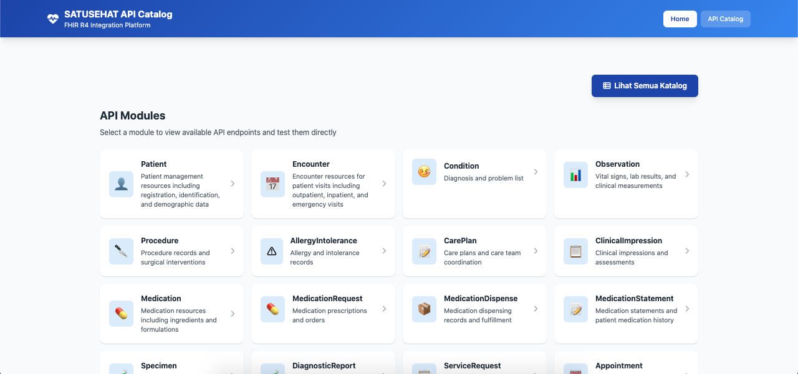
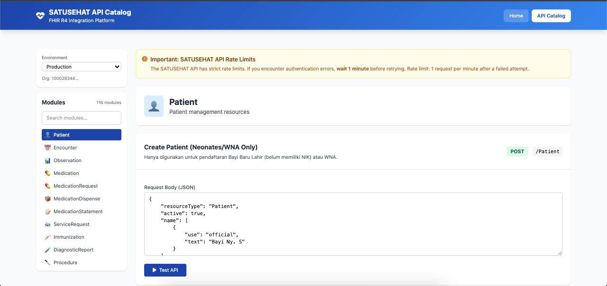

# SATUSEHAT API Catalog Platform

A native PHP + Tailwind CSS platform for exploring and testing SATUSEHAT FHIR R4 API endpoints.

## Features

- **API Module Catalog**: Browse all available FHIR R4 resource modules
- **Interactive API Testing**: Test API endpoints directly from the browser
- **Modal Response Display**: View API responses in a modal without page redirects
- **Module Search**: Quickly find modules using the search functionality
- **Environment Switching**: Toggle between Sandbox and Production environments
- **Token Caching**: Automatic token caching for better performance

## Project Structure

```
satusehat_catalog/
├── app/
│   └── modules/            # FHIR R4 resource modules
│       ├── patient.php
│       ├── encounter.php
│       ├── condition.php
│       └── ... (40+ modules)
├── config/
│   └── config.php          # SATUSEHAT API configuration loader
├── public/
│   ├── index.php           # Homepage - Module list display
│   ├── catalog.php         # API catalog with endpoint testing
│   ├── api_call.php        # API request handler
│   └── inc/
│       ├── header.php
│       ├── footer.php
│       ├── helpers.php
│       ├── scripts.php
│       └── styles.php
├── storage/
│   └── cache/              # Token cache directory
├── Satu-Sehat/
│   ├── collections/        # Postman collections
│   └── environments/       # Postman environment files
├── screenshoot/            # Application screenshots
├── .env                    # Environment variables
├── .env.example            # Example environment file
└── README.md
```

## Requirements

- PHP 7.4+
- cURL extension
- JSON extension

## Installation

1. Clone the repository
2. Copy `.env.example` to `.env`
3. Configure your SATUSEHAT credentials in `.env`
4. Ensure the `storage/cache/` directory is writable

## Configuration

Set environment variables in `.env`:

```env
# Application Environment
APP_ENV=development
APP_DEBUG=true

# SATUSEHAT Sandbox Credentials
SATUSEHAT_AUTH_URL=https://api-satusehat-stg.dto.kemkes.go.id/oauth2/v1
SATUSEHAT_BASE_URL=https://api-satusehat-stg.dto.kemkes.go.id
SATUSEHAT_ORGANIZATION_ID=your-org-id
SATUSEHAT_CLIENT_ID=your-client-id
SATUSEHAT_CLIENT_SECRET=your-client-secret

# SATUSEHAT Production Credentials
SATUSEHAT_PROD_AUTH_URL=https://api-satusehat.kemkes.go.id/oauth2/v1
SATUSEHAT_PROD_BASE_URL=https://api-satusehat.kemkes.go.id
SATUSEHAT_PROD_ORGANIZATION_ID=your-prod-org-id
SATUSEHAT_PROD_CLIENT_ID=your-prod-client-id
SATUSEHAT_PROD_CLIENT_SECRET=your-prod-client-secret
```

**Environment Settings:**
- `APP_ENV=production` - Enables SSL verification, disables debug output, hides raw responses
- `APP_ENV=development` - Disables SSL verification for local testing, enables debug mode

For production deployment, set `APP_ENV=production` to enable all security features.

## Usage

### Homepage (`index.php`)
Displays all available API modules in a grid format. Click any module to navigate to the catalog.

### API Catalog (`catalog.php`)
- View all endpoints for a selected module
- Test API endpoints with custom parameters
- View responses in a modal popup
- Search for specific modules using the sidebar search

### Testing an API Endpoint
1. Select a module from the homepage or sidebar
2. Choose an endpoint from the list
3. Fill in required parameters (if any)
4. Click "Test API"
5. View the response in the modal that appears

## Available Modules

| Module | Description |
|--------|-------------|
| Patient | Patient management resources |
| Encounter | Patient visit records |
| Condition | Diagnosis and problem list |
| Observation | Vital signs and lab results |
| Procedure | Surgical interventions |
| AllergyIntolerance | Allergy records |
| CarePlan | Care plans and coordination |
| ClinicalImpression | Clinical assessments |
| Medication | Medication resources |
| MedicationRequest | Prescriptions |
| MedicationDispense | Dispensing records |
| MedicationStatement | Medication history |
| Specimen | Lab test specimens |
| DiagnosticReport | Lab results |
| ServiceRequest | Service orders |
| Appointment | Scheduling |
| Consent | Patient consent |
| Coverage | Insurance coverage |
| Organization | Healthcare organization |
| Immunization | Vaccination records |
etc...

## API Response Modal

When testing an API endpoint:
- The response appears in a modal on the same page
- No page redirect occurs
- Close the modal or press ESC to continue
- Error messages are displayed with clear formatting

## API Call Handler

The `public/api_call.php` handles all API requests with the following features:

### Request Methods
- **JSON API**: Send POST requests with `Content-Type: application/json`
- **Form Data**: Use standard form parameters

### JSON API Format
```json
{
    "method": "GET",
    "path": "Patient",
    "params": {
        "id": "patient-id"
    },
    "body": {}
}
```

### Debug Mode
Add `?debug=1` to the URL in development mode to:
- View raw API responses
- See token information (sanitized)
- Access detailed error messages

**Note**: Debug mode is automatically disabled in production.

## Screenshots

### Homepage - Module List


### API Catalog - Endpoint Testing


## Security Notes

- **Token Caching**: Tokens are cached locally in `storage/cache/` for performance
- **HTTPS Required**: All API calls require HTTPS
- **SSL Verification**: Enabled in production mode (`APP_ENV=production`)
- **Error Display**: Disabled in production to prevent information disclosure
- **Debug Mode**: Only available in development mode, disabled in production
- **Input Validation**: HTTP methods are validated against a whitelist
- **Path Sanitization**: Directory traversal attacks are prevented
- **Sensitive Data Protection**: Tokens and raw responses are redacted in production

## License

© 2026 Kemenkes RI (Ministry of Health Indonesia)

## Version

v1.1 - Security improvements and environment-based configuration
- Added production mode with SSL verification
- Disabled debug output in production
- Added input validation and path sanitization
- Redacted sensitive data in production responses

v1.0 - Modern UI with modal responses